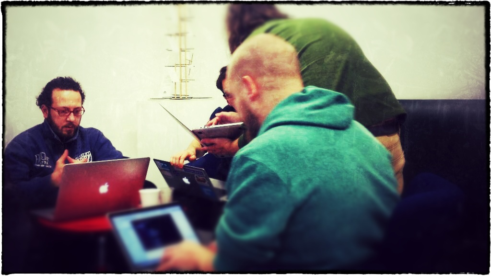

Railsponsibility
================

##Introduction

Most UK train users are unaware of their rights, e.g. to compensation after cancellations or delays. This was raised as an issues by the [Office for Rail Regulation](http://orr.gov.uk) in its ["Rail passenger compensation and refund rights" report](http://orr.gov.uk/publications/reports/rail-passenger-compensation-and-refund-rights), published on 20/2/2014.

Athough the situation is improving and [the amount of money paid out in compensation rose by £3m](http://www.bbc.co.uk/news/business-26275394) during last surveyed year, more can be done to make Network Rail and the rail operating companies accountable for the disservice they are responsible of. 

As much as we accept that not all incidents can be avoided, we believe that the huge amount of compensations that passengers are **not** claiming is allowing Network Rail and the operating companies to sleep over the problem, minimising intervention while keeping patting each others' backs and [awarding their directors 6-digit bonuses](http://www.bbc.co.uk/news/business-23367781).

[Some are fighting this using policy](http://www.thetimes.co.uk/tto/business/industries/transport/article3986840.ece). We believe there is one more channel we can use, that is supporting passengers to do what is in their rights and claim compensation down to the last penny.

##About *Railsponsibility*

The *Railsponsibility* project is aimed at building a system to monitor all train services being cancelled or delayed that match the criteria for compensation, to then remind the passengers who were affected of the disservice they were affected by and support them in filing the claim, automating as much as possible the process.

##International Open Data Day 2014

The first brainstorming and prototyping work was developed for the London Open Data Dat 2014 hackfest. You can read the [team's original notes](https://docs.google.com/document/d/1frKRTsy6c4qe-JpwDcY0vNHjUoS9ebc_eZT5LfzJDmM/edit?usp=sharing) and [view the outcome](International-Open-Data-Day-2014/).

Among the contributors were:

- Andy Lulham ([andylolz](https://github.com/andylolz))
- Gianfranco Cecconi ([giacecco](https://github.com/giacecco))
- Matias Piipari ([mz2](https://github.com/mz2))
- Thomas Down ([dasmoth](https://github.com/dasmoth))

... and others who did not leave their contacts! :-( In the picture are, from left to right, giacecco, andylolz, mz2 and, standing, dasmoth. Sorry we don't have a better one.

##Licence

 This work and all the data collected in the context of *delay-repay* is licensed under a [Creative Commons Attribution 4.0 International License](http://creativecommons.org/licenses/by/4.0/). By contributing software or data to the project you are subscribing to the terms of this licence.

The team picture was taken by [@raimondiand](https://twitter.com/raimondiand/status/437232231367843840) and enhanced a little by giacecco. 